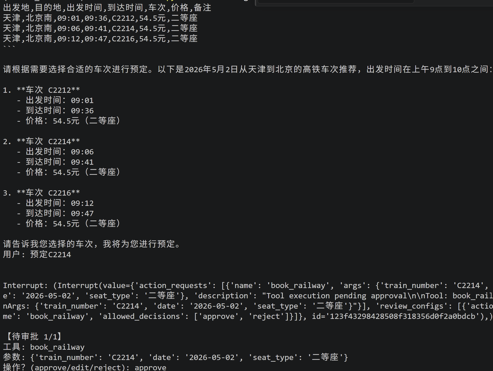

# 项目背景
出行助手agent

# 方案选型
## 模型选型
支持多厂家大模型接口调用，OpenAI、阿里通义千问、deepseek
## multi-agent
1.定义三个子agent，分别为行程规划（包含景点和酒店预定），火车预定和飞机预定，定义子agent为tool，然后定义supervisor agent进行任务分解与规划，使用Langchain中预置的ReAct架构的Agent
2.支持Function Calling，包含自定义工具和MCP Server提供的工具
### mcp server
行程规划，高德mcp server
自驾路线，高德mcp server
火车余票查询，github拉取https://github.com/Joooook/12306-mcp.git
npx -y 12306-mcp --port 8166  远程http协议
npx -y 12306-mcp
飞机余票查询，利用varflight mcp
sk-XyGJqV-Cs3S6HyHopv8DvdyHI4iE4Cu01qSJQZYysSA
3. 支持Short-term（短期记忆）和long-term（长期记忆）并使用PostgreSQL进行持久化存储
4. 支持Human in the loop（HITL 人工审查）对工具调用提供人工审查功能，支持approve，reject 和edit，在需要预定酒店高铁票或者飞机票是会触发
5. 支持修剪短期记忆中的聊天历史以满足上下文对token数量或消息数量的限制
6. 支持读取和写入长期记忆（如用户偏好设置等）

# 方案部署
## 后端
使用FastAPI框架实现对外提供Agent智能体API后端接口服务
## 前端
gradio实现前端demo应用，与后端API接口服务联调

